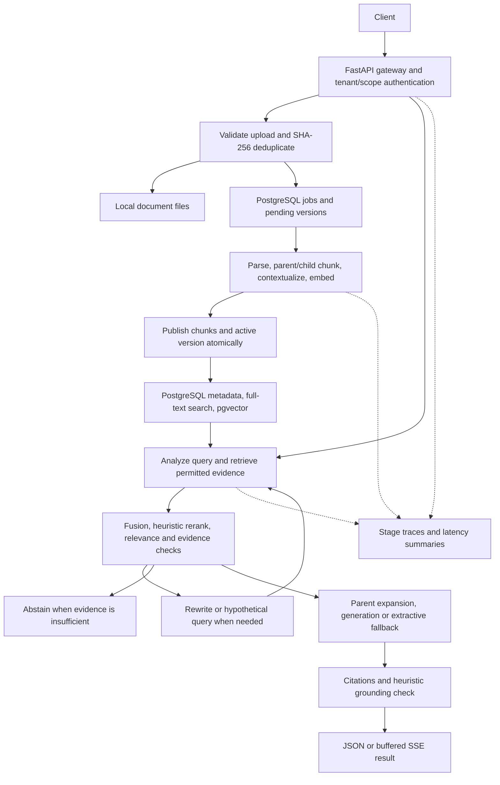

# RAG architecture: documented decisions and engineering walkthrough

Project: [Rag_Assignment](https://github.com/hemantdawn/Rag_Assignment)  
Project owner: Hemant Dawn

This is an AI-assisted retrospective based on the recorded project conversations and repository. Quoted prompts are Hemant's recorded words. Engineering explanations are retrospective commentary, not a verbatim transcript or a claim about unrecorded thoughts. The accompanying `COMBINED_CONVERSATION.md` preserves recorded exchanges separately. All source timestamps below are UTC.

## 1. Define the architecture before implementing components

**Recorded direction — 2026-09-30 17:21:53 UTC:**

> i want to create some thing like this architecture help me do this&#x20;

The accompanying user-provided diagram separated ingestion from querying behind a FastAPI gateway. It included authentication, SHA-256 deduplication, an ingestion queue and worker, Docling, parent/child chunks, contextual prefixes, hybrid retrieval, RRF, reranking, relevance gating, parent expansion, evidence sufficiency, citations, grounding checks, and SSE.

**Retrospective engineering explanation:** This establishes the responsibilities and failure boundaries before choosing infrastructure. Upload requests should validate and enqueue documents; parsing and embedding belong in a worker because they can be slow or fail independently. A query should retrieve permitted evidence, assess whether that evidence is sufficient, and only then generate an answer. Citations and abstention are part of the architecture rather than presentation details.

**Implementation evidence:** `app/main.py` provides upload/query routes; `app/worker.py` executes ingestion; `app/auth.py` enforces tenant/scope access. The initial diagram is a design target, not proof that every component has production-grade implementation.

## 2. Validate the document path with an actual PDF

**Recorded direction — 2026-09-30 17:50:26 UTC:**

> try ruuning through a sample pdf

**Recorded follow-up — 2026-09-30 18:03:07 UTC:**

> can you make the docling available in this enviroment

**Retrospective engineering explanation:** A text-only demonstration does not validate PDF conversion. Exercising a PDF exposes parser installation, model availability, extraction, and downstream chunking issues. Parser failure also needs to be distinguishable from retrieval failure. The final service supports Docling as an optional document dependency and text-PDF extraction with pdfplumber as a fallback; scanned documents still require OCR-capable processing.

**Implementation evidence:** `app/processing.py` parses documents and creates parent/child chunks. `pyproject.toml` declares the optional document dependencies. Original sample scripts were subsequently removed from the shared repository, so their historical smoke tests are not a bundled current test suite.

## 3. Preserve context while searching smaller passages

**Recorded design evidence:** The original diagram explicitly requested parent chunking, child chunking, contextual prefixes, and parent expansion.

**Retrospective engineering explanation:** Small passages improve retrieval precision, but can omit the surrounding rule or heading needed to answer accurately. Child chunks provide searchable units; parent chunks provide context for generation. Contextual text connects a child passage to its source structure. Binding citations to retrieved evidence also lets the caller inspect the source rather than trusting answer text alone.

**Implementation evidence:** `app/processing.py`, `app/embedding.py`, and `app/retrieval.py`. The default hash embedder is a deterministic baseline; optional sentence-transformers provide semantic embeddings. A working baseline does not establish production retrieval quality.

## 4. Make retrieval quality a decision point

**Recorded design evidence:** The original diagram included lexical and dense retrieval, RRF, a reranker, a relevance gate, query rewrite/HyDE when needed, and an evidence sufficiency check.

**Retrospective engineering explanation:** Finding a nearest passage is not the same as finding enough evidence to answer. Lexical and vector signals can complement each other, while fusion combines candidate rankings. A weak result should trigger another retrieval attempt or abstention. Generation then needs evidence-bound citations and a grounding check. The current reranking and grounding checks are heuristics, and should be evaluated on representative questions before deployment.

**Implementation evidence:** `app/retrieval.py` implements retrieval, rewriting, hypothetical-query support, evidence selection, generation, extractive fallback, and grounding checks. PostgreSQL lexical retrieval uses full-text search, so the initial diagram's BM25 label should not be read as a claim that the PostgreSQL implementation uses BM25. SSE returns the buffered result through events; it does not stream model tokens.

## 5. Add observability before diagnosing bottlenecks

**Recorded direction — 2026-09-30 18:14:45 UTC:**

> can you add **Observability:** per-stage tracing and latency, so you can see where time and failures concentrate.

**Retrospective engineering explanation:** Total request latency hides whether parsing, embedding, search, or generation caused a delay. Stage spans make failure locations visible and distinguish nested stage duration from exclusive time. Trace identifiers connect API requests, ingestion work, and query stages, allowing a concrete failure to be investigated without guessing which subsystem is responsible.

**Implementation evidence:** `app/observability.py` records stage events; the API exposes trace and stage-summary routes. `tests/test_end_to_end.py` checks stage coverage, tenant isolation, and worker failure visibility.

## 6. Consolidate persistence around a single source of truth

**Recorded direction — 2026-10-01 06:54:59 UTC:**

> do you agree with this
> **One store instead of three.** Dense index, FTS5, and metadata DB drifting apart is the most common source of ghost chunks. Postgres with pgvector and `tsvector` gives you one transaction for writes, ACL filtering inside the same query, and atomic version flips. If you outgrow it, move to Qdrant or OpenSearch with native hybrid search, but keep the "single source of truth" principle.

**Retrospective engineering explanation:** The useful architectural concern is consistency across metadata and searchable chunks. PostgreSQL can store document/version metadata, jobs, lexical search data, and vectors within transaction boundaries. Tenant/scope filters must apply during retrieval and parent expansion. The quote records the user's proposed rationale; its “most common” claim is not a measured finding from this project.

**Implementation evidence:** `app/postgres_db.py`, `app/storage.py`, and `compose.yaml`. Uploaded object bytes still reside on the local filesystem, so the final architecture does not place every artifact inside PostgreSQL. SQLite remains a small-trial fallback, with narrower versioning support. `app/migrate_sqlite.py` supplies a migration path.

## 7. Publish replacement document versions atomically

**Recorded direction — 2026-10-01 08:47:42 UTC, repeated at 09:01:02 UTC:**

> should we version the documents with an atomic publish?

**Recorded implementation request — 2026-10-01 13:12:01 UTC:**

> yes can you make it complete with data versioning and for the postgressql

**Retrospective engineering explanation:** Replacing a document introduces a race between indexing new content and serving existing queries. Keeping the active version separate from a pending replacement allows the old content to remain searchable until the new content is ready. Publishing chunks and updating the active pointer in one transaction prevents partially indexed content becoming visible. A failed replacement should preserve the old active version and support retry. Concurrent workers also need a rule that prevents an older completion from replacing newer published content.

**Implementation evidence:** `app/postgres_db.py` manages version creation, publication, failure, retry, and search sessions. `tests/test_postgres_versioning.py` checks failed replacements, retries, active citation version IDs, out-of-order completion, migration/reindexing, and query snapshot behavior.

## 8. Make validation and reproducibility part of delivery

**Recorded direction — 2026-10-01 13:04:17 UTC:**

> have tested every thing here

**Recorded documentation direction — 2026-10-01 15:51:20 UTC:**

> can you complete the readme file so that anyone can use it, add funtionaties details and how to use it

**Recorded integration direction — 2026-10-01 16:14:25 UTC:**

> i want to write the steps so that i can hook it any api which we want to with the rag

**Retrospective engineering explanation:** A repository is easier to assess when another engineer can reproduce setup, authenticate, upload, run the worker, query, and verify a replacement version. Provider configuration needs explicit compatibility boundaries: Chat Completions-compatible LLM endpoints can use the existing client configuration; other API formats require an adapter. An extractive mode provides a useful no-LLM execution path without concealing whether model generation actually ran.

**Recorded validation outcome:** The later session contains a test run reporting **5 passed**, including the PostgreSQL tests. This demonstrates the checked behaviors, not exhaustive correctness or production readiness. No additional live-provider or retrieval-quality benchmark is claimed here.

## Final architecture and remaining tradeoffs

The documented progression shows architectural direction, requests for realistic validation, attention to consistency and failure semantics, and follow-through on operational visibility. AI implemented and explained substantial portions of the code; the record should preserve that collaboration.

Production follow-up would include representative retrieval evaluation, stronger reranking/grounding evaluation, shared object storage, connection pooling, backup/retention policy, secrets management, and deployment hardening. These are follow-up considerations, not completed features or fabricated historical decisions.
